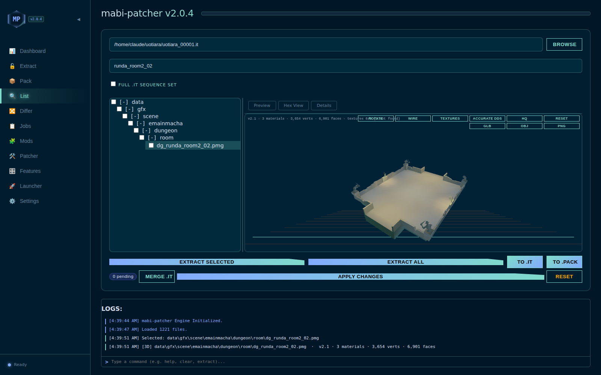
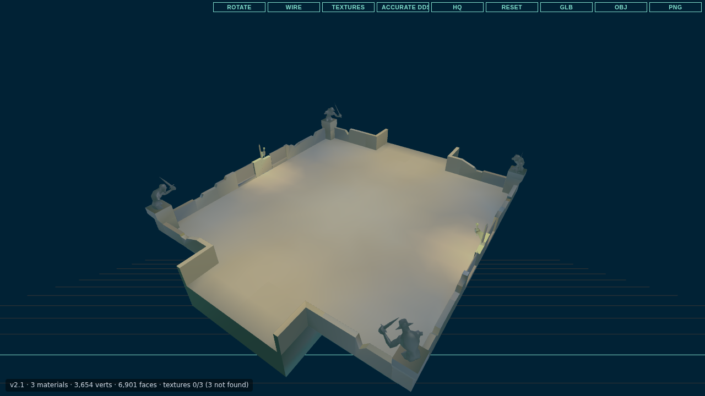
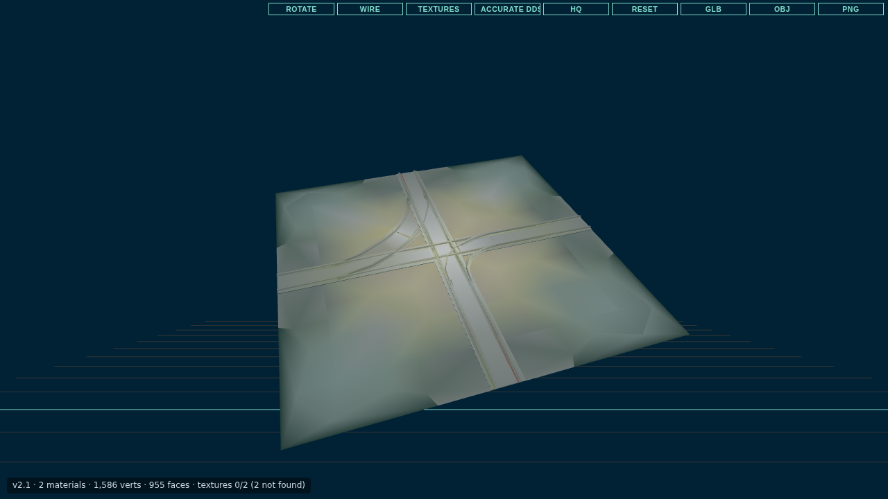
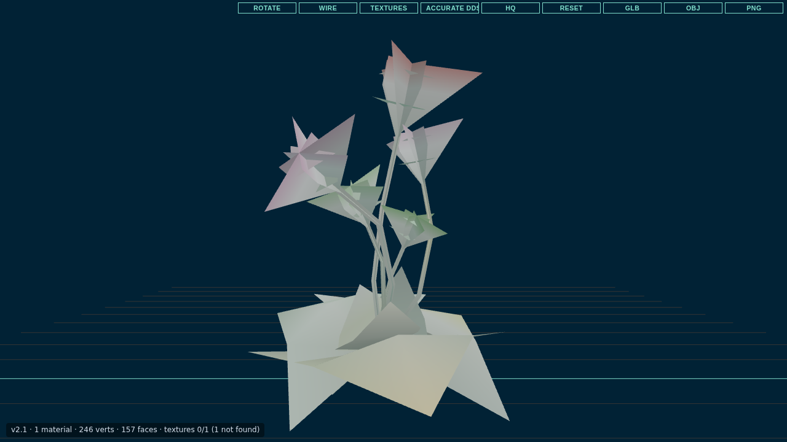

# mabi-patcher

mabi-patcher is a toolkit for Mabinogi. It does two jobs:

- **Archive tool.** Opens, extracts, previews, edits and builds the game's `.it` and `.pack` archives.
- **Launcher.** Logs in to Nexon, patches and repairs the game, and starts it without the Nexon Launcher. It works on Windows and on Linux / Steam Deck (through Wine).

It comes as a desktop app (Windows) and a command-line program (Windows and Linux). The same program can also run a local REST API with a web UI, and a built-in MCP server for AI clients.

Detailed documentation is in [docs/](docs/README.md).

---

## Features

### Archives
- Extract, pack, list and convert `.it` archives and legacy `.pack` archives. The salt is found automatically from a built-in list, or you can pass your own.
- Batch-extract a whole folder of archives, merged or one folder per archive.
- "Full sequence" mode: merge every archive in a folder into one.
- Make a patch archive from the difference between two folders.
- Parallel processing throughout, using all CPU cores.
- Optional conversions on extract: DDS → PNG, `features.xml.compiled` → XML, PMG → OBJ. When packing, PNG can be turned back into DDS.
- Path safety: extraction never writes outside the output folder, and packing refuses entry names the game cannot load (over 260 characters, or with characters Windows does not allow).

### Preview
- Preview pane with Visual, Hex and Details tabs. It shows images (`.dds`, `.png`, `.jpg`, `.bmp`), text and XML, compiled XML, `.rgn`/`.area` region data, `.set` animation headers, and audio (`.wav`, `.mp3`, `.ogg`, `.nxa`).
- **3D viewer** for `.pmg` models, built on three.js:
  - It loads the model's DDS textures automatically from the open archives, or for a loose file from nearby folders.
  - Controls: rotate, wireframe, high quality and accurate DDS.
  - Export to GLB or OBJ, or save a PNG snapshot.
- 3D viewers for `.gm` navigation meshes and `.eff` effect placements.
- **Item lookup**: the 3D viewer lists the items that use a model, and a search box finds items by name or id in `itemdb.xml` and opens their models.
- **Region map and 3D world**: a `.rgn` or `.area` file opens as a 2D map of the region (areas, terrain height, props, events), with a 3D view of the terrain and nearby prop models.

### Mods
- **Mods tab** with two views:
  - **Local** lists the `.mod` files in the `mods` folder next to the program and applies any of them to an archive with one click.
  - **Online (website)** browses the mod catalogue on the project website. You can search, filter by category or "installed only", and install, reinstall or remove each mod as `.it` (newer) or `.pack` (older / private servers). Installed packages are saved to `mods\web\`.
- `.mod` files are plain TOML. A mod can replace files, delete files, patch bytes at offsets, and turn game features on or off. Create one with "New .mod Template" or `mabi-patcher mod template`. See [docs/GUI.md](docs/GUI.md#mods).
- Edit an archive from the List tab like a file manager: multi-select, drag files in from Explorer onto a folder, move rows by dragging, Delete and F2, merge another archive, extract a selection or drag it out to Explorer. A "file already exists" dialog lets you overwrite, rename or skip. You can save queued edits and apply them later.
- Features tab: search and edit an archive's `features.xml.compiled`, with readable names for known feature hashes.

### Patcher and launcher (Mabinogi NA)
- **Nexon login**:
  - email and password, with two-factor (email or authenticator) codes;
  - or a browser login, importing the session from the official launcher, or importing it from Firefox, Chrome, Edge or Brave.
  - Several accounts can be saved as profiles, each with its own device id, and expired sessions are refreshed automatically.
  - On Windows, session tokens are kept in the Windows Credential Manager, not in the profile file.
- **Patcher**:
  - Downloads updates from Nexon's CDN in parallel, checks every part by hash, can pause, and can resume after a cancel.
  - Modes: Update, Verify (repair: re-hash every file) and re-download everything.
  - Choose which files to update, or check and patch every Mabinogi install on the PC.
  - A saved ignore list protects your own files from being overwritten.
- **Launch** without the Nexon Launcher. Maintenance and region blocks are reported before the game starts.
- **Four hooks**: commands that run before patch, after patch, before launch and after launch. The hooks and the ignore list are shared by the desktop app, the CLI and the REST API.
- **News**: the Nexon Mabinogi news feed on the Dashboard and in the CLI.
- **Private servers**: launch with a custom login IP and port.
- **Linux / Steam Deck**: the Linux build logs in and patches natively, and launches the game through Wine.

### Integration
- **REST API and web UI**: `mabi-patcher serve` serves the same interface in a browser. The desktop app can also run the API while it is open (Settings → Engine). See [docs/API.md](docs/API.md).
- **MCP server**: `mabi-patcher mcp` exposes the archive, mod, patcher and launcher tools to AI clients such as Claude Code. Session tokens are never shown to the model. See [docs/MCP.md](docs/MCP.md).
- Windows file associations for `.it`, `.pack`, `.dds`, `.pmg` and `.compiled`.
- Interface in **English, Traditional Chinese, Japanese and Korean**.
- **19 colour themes** (Sky, Mint, Peach, Rose, Gold, Sunset, Cream, Cyber, Matrix, Terminal Amber, Neon), most with light and dark variants.

---

## Screenshots



### 3D preview

Models from the UoTiara mod pack, rendered by the GUI's preview. These models' textures aren't in the mod pack, so they show baked vertex lighting and colours; with a real client install the preview applies each model's DDS textures as well.





## Download and build

Prebuilt binaries are not published from this repository yet. You can download the CLI built by CI from the **Actions** tab (`CLI build` workflow) on GitHub, or build it yourself.

### Windows (desktop app + CLI)

Requirements:
- [Rust](https://rustup.rs/), stable;
- Node.js and npm;
- the [Tauri 2 prerequisites](https://tauri.app/start/prerequisites/), including the MSVC build tools;
- the Microsoft WebView2 runtime (the app offers to install it if it is missing).

```bat
git clone https://github.com/shaggyze/mabi-pack2.git
cd mabi-pack2
build.bat
```

`build.bat` installs the frontend packages, runs `npm run tauri build` and copies the results to the repository root:

- `mabi-patcher.exe`: the desktop app. Run it with a command to use it as a CLI.
- `release\mabi-patcher-setup.exe` (NSIS) and `release\mabi-patcher-setup.msi`: the installers. They register the file associations.

`build-all.bat` does the same after a full clean.

To build only the CLI:

```bat
cargo build --release --bin mabi-patcher
```

The result is `target\release\mabi-patcher.exe`.

### Linux / Steam Deck (CLI)

Requirements: Rust (stable) and a C compiler (`build-essential` or your distribution's equivalent).

```sh
git clone https://github.com/shaggyze/mabi-pack2.git
cd mabi-pack2
./build-linux.sh        # → release/mabi-patcher-linux-x86_64
```

To launch the game on Linux, you also need the **Windows** `mabi-patcher.exe` next to the Linux binary (or set `MABI_WINE_EXE`). The game's sign-in pieces have to run inside the Wine prefix. See [docs/LAUNCH.md](docs/LAUNCH.md#linux-steam-deck-and-wine).

More detail (build scripts, pre-commit checks, tests, CI) is in [docs/DEVELOPMENT.md](docs/DEVELOPMENT.md).

---

## Quick start: desktop app

1. Run `mabi-patcher.exe`. You can also drop an archive on it, or double-click a registered `.it`/`.pack` file.
2. The tabs, top to bottom:

| Tab | Use it to |
|---|---|
| **Dashboard** | Watch CPU, RAM, disk and network, patch progress, Mabinogi news and recent activity. |
| **Extract** | Extract an archive (salt detected automatically). |
| **Pack** | Build a `.it` or `.pack` from a folder. |
| **List** | Browse an archive as a tree, preview entries, extract or edit them (drag and drop, move, rename, delete, merge). |
| **Differ** | Build a patch archive from two folders. |
| **Jobs** | Queue extract, pack, diff, merge and apply-mod jobs and run them all. |
| **Mods** | Apply local `.mod` files, or browse and install mods from the website. |
| **Patcher** | Check, patch, verify or repair the game; choose files, check all installs, pause and resume. |
| **Features** | Edit `features.xml.compiled`. |
| **Launcher** | Log in (or import a login from your browser), manage profiles, choose the game folder, launch. |
| **Settings** | Language, theme, file associations, portable mode, the in-app REST API, minimize to tray, patcher ignore list, hooks, launch mode and (under Advanced) the Nexon product id. |

Full tour: [docs/GUI.md](docs/GUI.md).

---

## Quick start: command line

The CLI is `mabi-patcher` (Linux) or `mabi-patcher.exe` (Windows). Add `-v`, `-vv` or `-vvv` for more logging. Full reference: [docs/CLI.md](docs/CLI.md).

### Archives

```sh
mabi-patcher extract -i data_00.it -o ./out              # salt found automatically
mabi-patcher extract -i data_00.it -o ./out -f '\.xml$'  # only XML files (regex)
mabi-patcher list    -i data_00.it
mabi-patcher pack    -i ./out -o mymod.it -k '<salt>' --wrap-data
mabi-patcher convert -i old.pack -o new.it
mabi-patcher mod template > mymod.mod
```

### Log in, patch and launch

```sh
# Log in once. The password is read from MABI_PASSWORD so it stays out of your shell history.
export MABI_PASSWORD='<your password>'
mabi-patcher login -u you@example.com --profile Main -c "C:\Nexon\Library\mabinogi"

# If Nexon asks for a two-factor code, login prints the command to finish:
mabi-patcher login-otp -u you@example.com --mfa-key <KEY> --otp <CODE>

mabi-patcher check-update        # exit code 2 = an update is available
mabi-patcher update              # --verify to repair, --force-all to re-download, -j N workers
mabi-patcher launch --no-wait

# Or take the login from a browser you are already logged in with:
mabi-patcher import-cookies --profile Main
```

### Choose files, several installs, news

```sh
mabi-patcher update --scan-only                 # list what needs updating
mabi-patcher update --only '<path from the scan>'  # patch only these paths (or --select list.txt)
mabi-patcher check-update --all-folders         # every Mabinogi install found on this PC
mabi-patcher update --folder 'D:\Mabinogi' --folder 'E:\Mabinogi'
mabi-patcher news
```

### Ignore list and hooks

```sh
mabi-patcher config ignore add 'mods/*'
mabi-patcher config hook before-patch  'backup.bat'
mabi-patcher config hook after-patch   'echo patched'
mabi-patcher config hook before-launch 'echo starting %PROFILE%'
mabi-patcher config hook after-launch  'start-overlay.bat'
mabi-patcher config show
```

### Linux / Steam Deck

```sh
export WINEPREFIX="$HOME/Games/mabinogi"
export MABI_WINE=wine64          # optional: Wine runner (default: wine)
mabi-patcher launch -c "$WINEPREFIX/drive_c/Nexon/Library/mabinogi" --no-wait
```

### REST API and web UI

```sh
cd gui && npm install && npm run build && cd ..   # builds the web UI into gui/dist
mabi-patcher serve                               # http://127.0.0.1:7331/
```

The server listens on loopback only by default. Binding to another address (`--host 0.0.0.0`) requires `MABI_API_TOKEN`, which clients then send as a bearer token. In an interactive terminal, `serve` stops when you press Enter; otherwise it runs until the process is stopped. The desktop exe takes the same command (`mabi-patcher.exe serve`). See [docs/API.md](docs/API.md).

### MCP server

```sh
claude mcp add mabi-patcher -- /path/to/mabi-patcher mcp
```

Any MCP client works: run the binary with the single argument `mcp`. See [docs/MCP.md](docs/MCP.md).

### Docker

`docker compose up` builds an image that runs `mabi-patcher serve` with the web UI on port 7331. Set `MABI_API_TOKEN` first (in a `.env` file or the environment): the container listens on `0.0.0.0`, and the server refuses non-local requests without a token. Mount your archives at `/data/archives` and your mods at `/data/mods` (see `docker-compose.yml`).

---

## Documentation

| Document | Contents |
|---|---|
| [docs/CLI.md](docs/CLI.md) | Every command and flag. |
| [docs/GUI.md](docs/GUI.md) | The desktop app, preview, 3D viewer and mods. |
| [docs/API.md](docs/API.md) | REST API routes and the web UI. |
| [docs/MCP.md](docs/MCP.md) | The built-in MCP server and its tools. |
| [docs/NEXON_AUTH.md](docs/NEXON_AUTH.md) | How the Nexon login works. |
| [docs/SESSION.md](docs/SESSION.md) | Profiles, sessions and settings files. |
| [docs/NXL_PATCHER.md](docs/NXL_PATCHER.md) | The patcher. |
| [docs/LAUNCH.md](docs/LAUNCH.md) | Launching on Windows and under Wine. |
| [docs/PACK_FORMAT.md](docs/PACK_FORMAT.md) | The `.it` and `.pack` formats. |
| [docs/DEVELOPMENT.md](docs/DEVELOPMENT.md) | Building, testing, CI and known issues. |

---

## Credits
- Based on original utilities by regomne.
- Launcher and patcher ported from [Rua](https://github.com/riistar/Rua). Big thanks to Rii (riistar) for Rua and for working out the Nexon launcher, auth and patcher flows it is built on.
- Enhanced and maintained by ShaggyZE.

## License

MIT. See [LICENSE-MIT](LICENSE-MIT).
